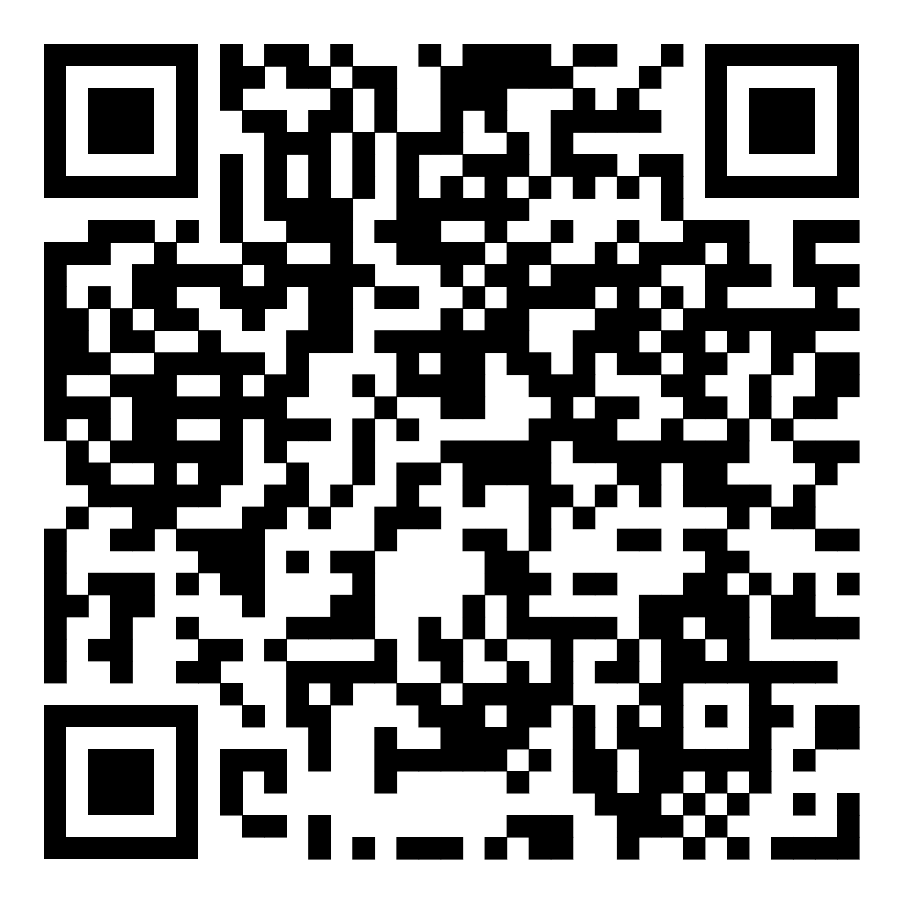

# Проект: Верстка сайта "REVO Coffee"
## Проект
Этот репозиторий содержит результат проработки мобильного интерфейса для кофейного магазина "REVO Coffee". Основной фокус сделан на адаптивности, удобстве навигации на Touch-устройствах и создании интерактивного пользовательского опыта.
## Цель
Освоение принципов проектирования мобильных интерфейсов с учетом гайдлайнов Apple HIG и Google Material Design. Реализация удобного «гамбургер-меню», фиксация элементов навигации и обеспечение визуальной обратной связи (feedback).
## Технологии
- HTML5
- БЭМ (Блок-Элемент-Модификатор)
- CSS3
- Адаптивная вёрстка: Подход Desktop First
- JavaScript

## Ссылки
- [Публичная страница на GitHub Pages](https://simcwagcable.github.io/Project_FBD/)

## Проверка мобильной версии
Сканируйте QR-код, чтобы открыть проект на мобильном устройстве:

